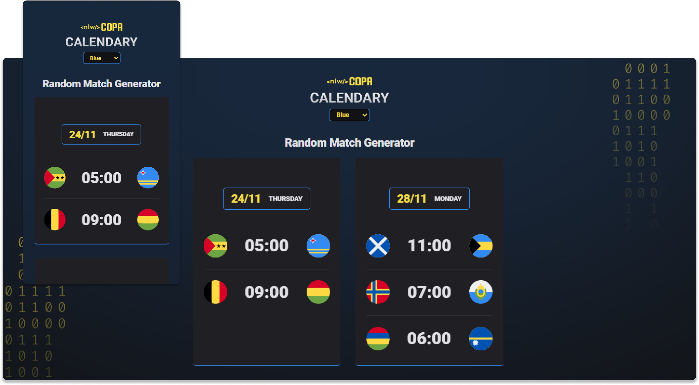

<!--Heading-->
<h1 align='center'>
  
	&nbsp;-&nbsp;
  
</h1>

  • <strong>NLW Copa</strong> - <strong>Explorer</strong> | Exclusive, free event promoted by <strong>Rocketseat</strong> for teaching <strong>Web Technologies</strong>.

  &nbsp;
  

 
<!--/Heading-->

<!--Section-->

  ⚙️ Languages and tools used in the project

  &nbsp;&nbsp;
  &nbsp;&nbsp;
  &nbsp;&nbsp;
  

 
<!--/Section-->

<!--Section-->

  

<!--/Section-->
